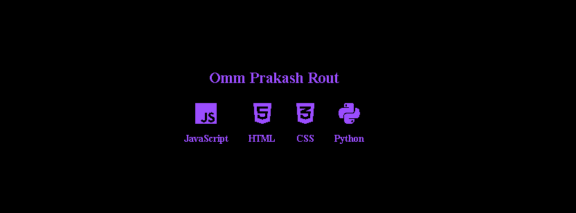
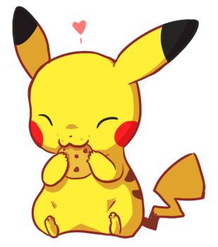

<h2 align="left">Yohho 👋! My name is Omm Prakash Rout. I'm a passionate student and an aspiring web developer</h2>

###

  

###

###

  
~<I>Languages & Tools<I>~

  
  
  
  
  
  
  
  
  
  
   

  
~Database~

  

###

<b>~Social Contacts~</b>

  
  
  

###

 

###

